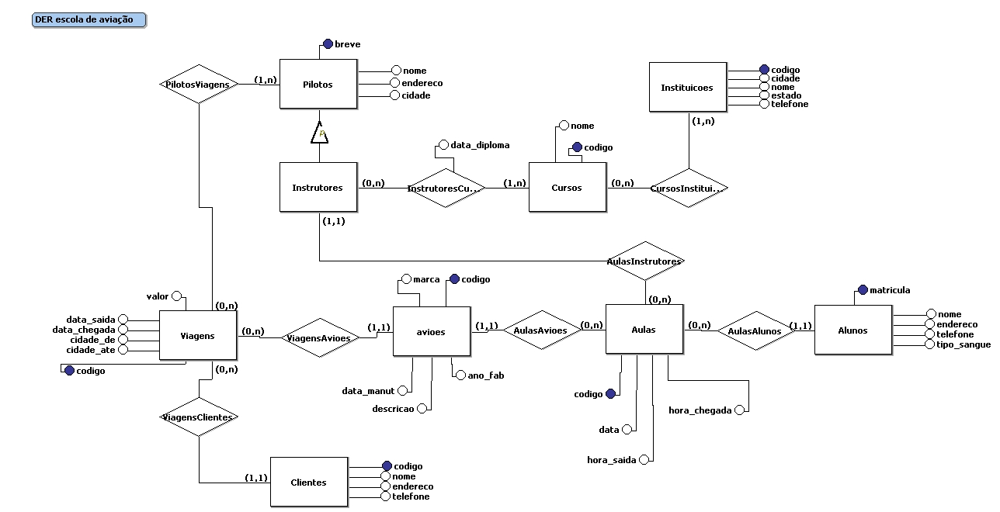
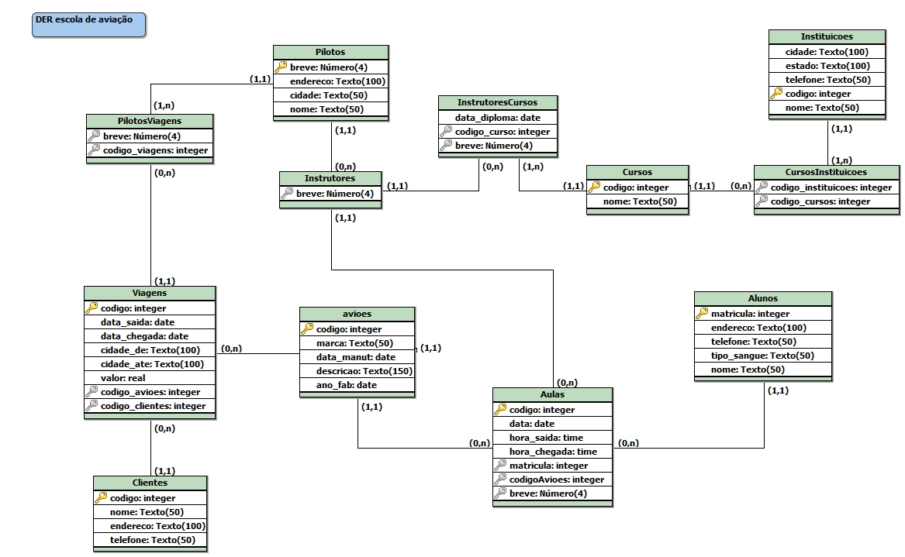

# escola-de-aviadores

## Tecnologias Usadas


## Dados Gerais

    • Integrantes: Adriano Canofre, Evandro Bolzan, Gabriel Lunardi e Luiz Felipe
    • Grupo 4 – apresentação dia 14/02/2013, aula 30
    • Professora: Deise Saccol
    • Disciplina: Projeto e Gerência de Banco de dados – ELC1071 – 5º Semestre
    • Tecnologias utilizadas:
        ◦ Linguagem de programação: Java Desktop (JDK 1.7)
        ◦ SGBD: PostgreSQL 9.1 (JDBC versão 9.1-903)
        ◦ Ferramenta ORM: Hibernate
        ◦ Relatórios: JasperReports + iReport (design) 5.0.1
        ◦ IDE: NetBeans 7.2.1
        ◦ Versionamento de código: Google Code (SVN): http://code.google.com/p/escola-de-aviadores/ 
        
Automatically exported from code.google.com/p/escola-de-aviadores

## Descrição do domínio do BD e modelo Conceitual (diagrama)

Em um aeroclube existem pilotos que são identificados por um brevê que é usado como chave identificadora, o qual possuem outros atributos como nome, endereço, cidade. Também existem instrutores de voo que são os pilotos do aeroclube com uma formação adicional em algum curso. Para esses cursos deve ser armazenado nome do curso, código(identificador), data de obtenção do diploma e a instituição que deu o curso. Sobre essas instituições deve ser guardados um identificador que é o código, e também deve ser guardado o nome, cidade, estado e telefone. Sobre os aviões que são usados nas aulas de pilotagem devem ser armazenados com código, marca, descrição, ano de fabricação, data da ultima manutenção. Para os alunos de pilotagem são obtidos os atributos matrícula (identificador), nome, endereço, telefone, tipo sanguíneo. Para realização das aulas devem ser guardadas informações como número único, aluno, instrutor e aeronave, além da data, hora de saída, hora de chegada, esta será usada para contabilização total das horas de voo do aluno para a obtenção de brevê. Essa escola de voo também oferece o serviço de viagens, que é somente disponibilizado para clientes. Sobre os clientes devemos saber código(identificador), nome, endereço, telefone. Para cada viagem é preciso ter um número único, data de saída, data de chegada, cidade de origem, cidade de destino, valor cobrado pelo serviço, o piloto (pode ser mais de um piloto), o cliente e a aeronave utilizada.



## Modelo lógico do BD (tabelas)



## Criação da base de dados no PostgreSQL

Foram implementadas as seguintes tabelas na aplicação, com as quais são realizadas as consultas. O arquivo “escola-aviacao.sql” compõe o script de criação do banco de dados

    • Alunos;
    • Clientes;
    • Aviões;
    • Pilotos;
    • Viagens;


## Aplicação Desktop: Gerenciador de Aeroclube
### Detalhes técnicos da aplicação
    • Arquivo de config: <pacote default>/hibernate.cfg.xml
    • Usuário para BD: usersi
    • Senha: sistemas 
    • Driver: org.postgresql.Driver
    • JDBC-URL: jdbc:postgresql://localhost:5432/escola_aviadores
### CRUDs
    • Inserção/remoção/edição para as tabelas mencionadas na seção 4
### Relatórios
	Totalizam 6, são eles:

#### Relatório 1: Obter todos os dados de Alunos ordenados pelo nome:
```
SQL: SELECT * FROM alunos ORDER BY nome

```

#### Relatório 2: Todos os dados de clientes, em ordem alfabética, que realizaram viagens em aviões da marca AirBus:
```
	SQL: SELECT clientes.* FROM clientes CROSS JOIN avioes, viagens
		WHERE clientes.codigo=viagens.codigo_clientes
		AND avioes.codigo=viagens.codigo_avioes
		AND avioes.marca LIKE'AirBus'
		ORDER BY clientes.nome
```
#### Relatório 3: As cidades de destino das viagens quem saíram de Porto Alegre ou Santa Maria, mostrando as cidades de saída (PoA ou Sta Maria):
```
SQL: SELECT cidade_de, cidade_ate FROM viagens 
WHERE cidade_de 
IN ('Santa Maria', 'Porto Alegre')
```
#### Relatório 4: Mostrar a marca e a data do avião mais antigo de todos de cada marca:
```
SQL: SELECT marca, min(ano_fab) AS data_fabricacao FROM avioes 
GROUP BY marca HAVING min(ano_fab) = min(ano_fab)
```

#### Relatório 5: Código dos aviões que realizaram manutenção em janeiro de 2013 ou realizaram viagens entre 15-01-2013 e 10-02-2013:
```
SQL: (SELECT codigo FROM avioes WHERE data_manut BETWEEN '2013-01-01' AND '2013-01-31') 
UNION 
(SELECT codigo_avioes FROM viagens WHERE data_saida BETWEEN '2013-01-15' AND '2013-02-10');
```

#### Relatório 6: Mostrar o código e a descrição dos aviões que já realizaram alguma viagem:
```
SQL: SELECT DISTINCT codigo_avioes, descricao FROM viagens, avioes WHERE codigo_avioes=avioes.codigo
```
